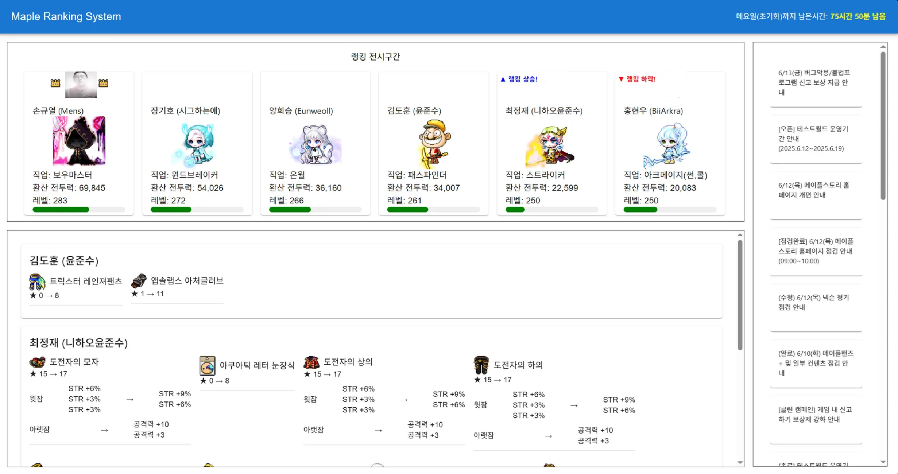
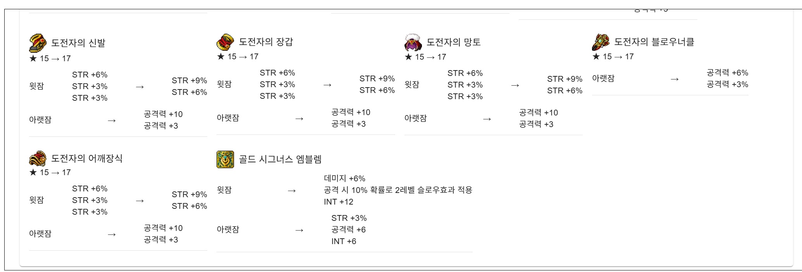

# 📊 Maple Project – 캐릭터 랭킹 시스템  

메이플스토리 캐릭터 정보를 활용한 **랭킹 시스템**으로,  
캐릭터의 장비 정보, 잠재옵션, 스타포스 등을 기반으로 환산 전투력을 계산하고 랭킹을 표시하는 기능을 갖추고 있습니다.
또한 스펙업한 장비를 감지하여 자동으로 띄워주는 기능을 갖추고 있습니다.

배포주소: https://didgmltmd.github.io/Maple_Project/

---

## 주요 기능
- 캐릭터 정보(OCID 포함) 로컬스토리지 저장 및 업데이트  
- API를 통해 장비 정보 조회 → 장비 스펙 변경 감지 → 환산 전투력 계산  
- 랭킹페이지: 6명 캐릭터 비교 및 등수 표시  
- 캐릭터 카드 컴포넌트 분리: `CharacterCard` 컴포넌트는 읽기 전용으로 유지  
- Front-end: React + MUI 기반  
- 로직: 메인페이지에서 API통신, localStorage 저장 → 랭킹디스플레이페이지에서 localStorage 기반 환산 및 표시  

---

## 기술 스택
| 범주             | 기술                                 |
|------------------|--------------------------------------|
| 프론트엔드       | React, MUI                           |
| API 통신         | Axios                                |
| 로컬 저장소       | localStorage                        |
| 배포             | githubPage               |

---

## 메인페이지

> - **핵심 기능**
> - 캐릭터 전투력 표기
> - 캐릭터 이미지 클릭시 자세한 환산전투력 사이트로 연결
> - 랭킹 표시 및 랭킹 하락, 상승시 시각적 표시

## 장비표시 페이지

> - **핵심 기능**
> - 스펙업한 장비 자동 감지 및 표기

